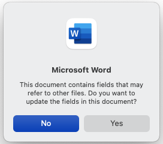
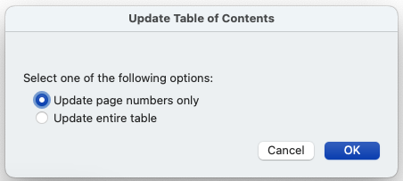

# PIFSC Data Report Template
This repository is designed to allow you to prepare a PIFSC Data Report
in R. It does this by rendering the report as a Quarto book. The
rendered report will still need some additional formatting, so only a
Word document is rendered (no pdf or HTML documents).

### What's in the repository?
This repository contains a few categories of files.

#### Files you should edit
For the most part, all the files you need to work with end in `.qmd`.
Their file names match what they are with the exception of `index.qmd`.
Quarto requires a book to have a file by this name. Here, it's used to
generate the front matter of the data report. There are some fields
you'll need to edit. Follow the instructions in the file. Ask questions
as they arise—you are almost certainly not the only one with your
question, so asking it will help others, too.

Every file that ends with `.qmd` will appear in your data report unless
you take steps to prevent this. First, follow the instructions in each
document.\
After that, update the chapters listed in `_quarto.yml` to include only
the files you want to use and in the order you want to use them. Again,
please reach out with questions.

#### Files you should NOT edit
There are a few files you should not edit. These include the graphic for
the DoC seal, the Citation Style Language (csl) file, and the template
Word doc.

#### Files you'll end up ignoring
The files in `ExampleContent` are used in the Quarto template examples
and by this ReadMe. Once you're working with your actual data report,
you can safely delete them from your computer if you want.

## Rendering the data report
You can render the data report from any `.qmd` file that's used in the
report. The rendered report will be in a folder named `_book` that.
Quarto will create this in your R project the first time you render the
book, and subsequent renderings will overwrite the existing version.

When you open the document in Word, you'll be confronted with two
dialogue boxes:  
The first asks if you want to update fields in the document.  Click "Yes".  

\
The second asks how you want to update the Table of Contents.  Select "Update 
entire table" and click "OK".  I'm not sure it really matters which you select, 
though.  

\

There are instructions in the rendered document (also in `index.qmd`) to guide
you through some formatting you'll need to do in Word.  While this template does
let you work collaborative with your coauthors, it doesn't handle all the detailed
formatting as well as I'd like.  If you know how to improve any of these steps, 
please let me know, submit a pull request with the proposed changes, or open an 
issue.

Finally, you'll need to add the cover page manually.  Our editor extraordinaire
can help you with this.

## Questions? Comments? Corrections?

Please open an issue or email Phoebe.Woodworth-Jefcoats\@noaa.gov

------------------------------------------------------------------------

### Disclaimer

This repository is a scientific product and is not official
communication of the National Oceanic and Atmospheric Administration, or
the United States Department of Commerce. All NOAA GitHub project code
is provided on an ‘as is’ basis and the user assumes responsibility for
its use. Any claims against the Department of Commerce or Department of
Commerce bureaus stemming from the use of this GitHub project will be
governed by all applicable Federal law. Any reference to specific
commercial products, processes, or services by service mark, trademark,
manufacturer, or otherwise, does not constitute or imply their
endorsement, recommendation or favoring by the Department of Commerce.
The Department of Commerce seal and logo, or the seal and logo of a DOC
bureau, shall not be used in any manner to imply endorsement of any
commercial product or activity by DOC or the United States Government.

### License

This repository uses the Creative Commons Zero v1.0 Universal (CC0 1.0
Universal) license.\
Additionally, Software code created by U.S. Government employees is not
subject to copyright in the United States (17 U.S.C. §105). The United
States/Department of Commerce reserves all rights to seek and obtain
copyright protection in countries other than the United States for
Software authored in its entirety by the Department of Commerce. To this
end, the Department of Commerce hereby grants to Recipient a
royalty-free, nonexclusive license to use, copy, and create derivative
works of the Software outside of the United States. See LICENSE for
further details.
